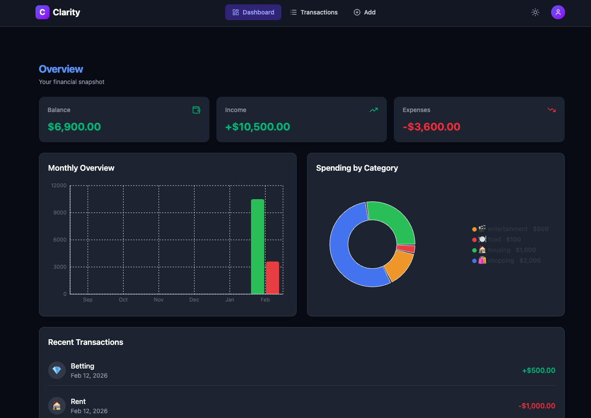
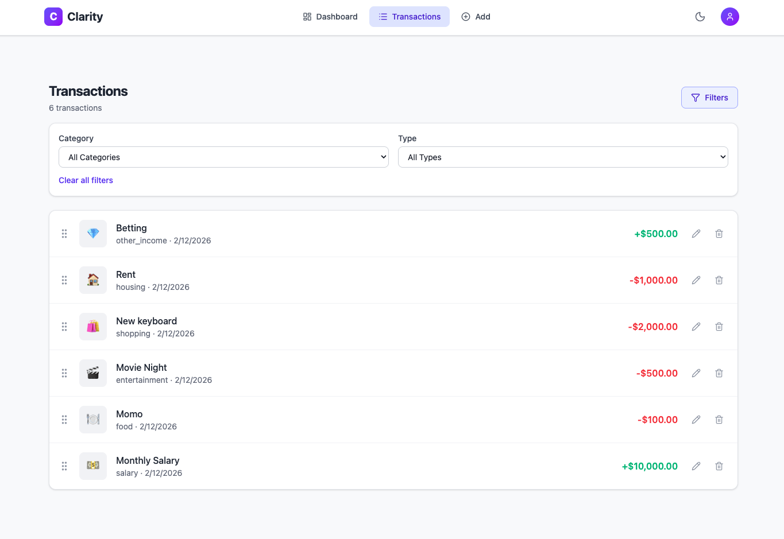
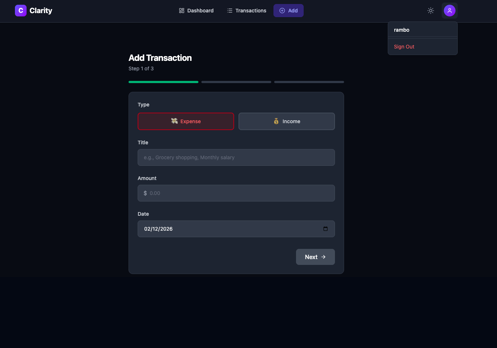

# Clarity

**Clarity** is a financial management tool designed to help users track transactions, manage expenses, and gain clear insights into their finances through a clean and intuitive interface.

🔗 **Live URL:** https://clarity.ramanbaral.live

---

## Test Credentials
**username** - rambo 

**password** - pass

## 🚀 Features

- User authentication (signup & login)
- Track income and expenses
- Categorize transactions
- View financial summaries and insights
- Dark / Light Theme
- Responsive and user-friendly UI

---

## 🛠 Tech Stack

### Frontend

- **React**
- **TypeScript**

### Backend

- **NestJS**

### Database

- **PostgreSQL**

---

## 📁 Project Structure

```bash
clarity/
├── client/        # React + TypeScript application
├── server/         # NestJS backend server
└── README.md
```
### ScreenShots
---




### 👤 Author
---
**Raman Baral** 

Full Stack Software Engineer